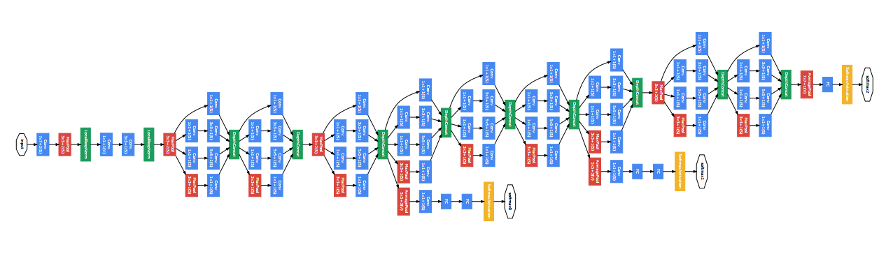

## Inceptionv1
This repository contains code for pre-training the Inceptionv1 model on the imagenet and finetuning on LSUN, CIFAR-10, CIFAR-100, and Pascal VOC 2012 datasets.
Architecture of GoogLeNet from the paper:



The code is organized into the following files:
- `src/pre_trained/train.py`: Contains functions for pre-training and evaluating the model.
- `src/fine-tuning.py`: Contains functions for fine-tuning and evaluating the model on CIFAR-10, CIFAR-100, and LSUN datasets.
- `src/pascal.py`: Contains code specifically for training and evaluating on the Pascal VOC 2012 dataset.
- `models/inception.py`: Contains the implementation of the Inceptionv1 model with auxiliary classifiers.
## Usage
1. Clone the repository:
   ```bash
   git clone https://github.com/AbenezerKb/inception.git
   cd inception
   ```
2. Install the required packages:
   ```bash
   pip install -r requirements.txt
   ```
3. Pre-train the Inceptionv1 model on the ImageNet dataset:
   ```bash
   python src/pre_trained/train.py
   ```
4. Fine-tune the model on a specific dataset (e.g., Pascal VOC 2012):
   ```bash
   python src/pascal.py
   ```
## Notes
- Ensure that you have the necessary datasets downloaded and properly organized in the expected directory structure.
- Modify the hyperparameters and configurations in the scripts as needed for your specific use case.
## License
This project is licensed under the MIT License. See the LICENSE file for details.
## Acknowledgements
- The Inceptionv1 model implementation is based on the original paper "Going Deeper with Convolutions" by Szegedy et al.
- Datasets used in this project are publicly available and credited to their respective sources.
